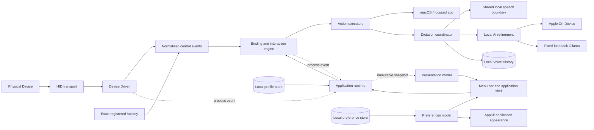

# Architecture

**Status:** current source implementation.

## Shape

The arrows on the top row are the latency-critical path. UI, persistence, and
diagnostics observe that path but cannot block it.

## Stack

| Concern             | Choice                                                                        |
| ------------------- | ----------------------------------------------------------------------------- |
| Languages           | Swift 6 with strict concurrency; Rust 1.98 for portable Voice policy.         |
| App UI              | SwiftUI four-destination shell hosted by one AppKit window controller.        |
| Hardware            | IOKit `IOHIDManager` and `IOHIDDevice` APIs.                                  |
| Synthetic shortcuts | Core Graphics `CGEvent`, guarded by Accessibility trust.                      |
| Keyboard fallback   | Carbon `RegisterEventHotKey`; exact active-Profile chords only.                |
| Audio capture        | Configuration-leased `AVAudioEngine`, bounded in-memory buffer stream.         |
| Speech recognition   | `SpeechAnalyzer` on macOS 26+; on-device-required `SFSpeechRecognizer` before. |
| Local AI refinement  | `SystemLanguageModel` on macOS 26+ or structured fixed-loopback Ollama generation. |
| Transcript delivery  | Accessibility insertion plus guarded buffered Unicode event routes.            |
| Persistence         | Versioned Codable JSON for configuration; system SQLite plus atomic CAF artifacts for Voice History. |
| Logging and timing  | Unified Logging, `OSSignposter`, and a monotonic clock.                       |
| Tests               | Swift Testing, Rust/C conformance, and scripted packaged-UI and Accessibility inspection. |
| Dependencies        | Apple frameworks only in the app; portable retention has no production crate dependency; Ollama is an optional separately installed local service. |
| Distribution        | Apache License 2.0 source; Apple Development-signed personal iterations; gated Developer ID, notarization, and free-DMG workflow for a future approved public release. |

[`decisions/0001_native_macos_stack.md`](decisions/0001_native_macos_stack.md)
records the stack rationale.

## Application identity and local data

The app, logging subsystems, and process queues use
`com.longdevity.hardwarecontroller`. The shared identity boundary resolves only
that Application Support directory and rejects a file occupying the required
path. Voice History uses its `voice/` child with one SQLite database and one
retained CAF at most per Voice session. The public snapshot contains no
predecessor personal namespace.

Changing the signed bundle identifier creates a new macOS privacy identity.
Accessibility, Microphone, Speech Recognition, and Launch at Login state may
therefore require user approval again. Signing identities and Team identifiers
remain in ignored local environment files, never source-controlled policy.

[`decisions/0024_longdevity_application_identity.md`](decisions/0024_longdevity_application_identity.md)
records the private transition, and
[`decisions/0026_remove_legacy_personal_identity.md`](decisions/0026_remove_legacy_personal_identity.md)
records its removal from the public snapshot.

## Component boundaries

### Domain

Pure, hardware-agnostic value types and state machines:

- stable Device and Control identifiers;
- Device capability and presentation metadata;
- timestamped Control events;
- Action configuration and capabilities;
- Binding and Profile models;
- Momentary and Toggle interaction state;
- active-action ownership and idempotent cleanup.

Domain code imports no IOKit, SwiftUI, AppKit, Accessibility, file-system, or
logging frameworks.

### Portable Voice core

`voice_core` is the first cross-platform engine tracer. It owns a dependency-
free retention policy using UUID bytes, Unix epoch milliseconds, immutable
candidates, typed validation failures, and ordered decisions. It imports no
Apple type and denies unsafe Rust. `Tests/cuj/voice_retention_v1.json` is read by
both Rust and Swift, proving policy parity while the shipped macOS app still
uses the Swift baseline.

`voice_ffi` exposes that policy through one synchronous `V1` C ABI. The caller
owns candidate and decision memory; a capacity-probe call reports the required
decision count. No callback, allocator, thread, runtime handle, or pointer
survives return. Reserved bytes and Boolean encodings fail closed. Rust layout
tests plus a real C17 consumer protect the source-controlled header. Swift and
Kotlin wrappers remain typed platform adapters and may not add retention policy.
See [decision 0035](decisions/0035_portable_voice_c_abi.md).

### HID transport

The hardware-input boundary owns `IOHIDManager`, exact matching, device removal,
and typed input-value callbacks. The first implementation maps the three Button
elements on its dedicated queue and emits immutable normalized events. It does
not know what Dictation is.

The Infinity 3 transport explicitly opens the exact supported VEC collection
with exclusive ownership before activation. The connected unit proved this is
necessary because macOS otherwise maps its Button elements to pointer clicks.
Unsupported Devices and broader HID matches must never be seized. See
[`decisions/0004_exclusive_vec_ownership.md`](decisions/0004_exclusive_vec_ownership.md).

### Driver registry and Drivers

The current `HardwareInputSource` protocol isolates lifecycle and Driver
metadata from the app model. A future composite source can select Drivers using
a narrow signature:
vendor/product identity, usage metadata, report descriptor characteristics, and
any required firmware marker. A Driver provides:

- a stable model identifier and human-readable name;
- an optional trustworthy stable hardware identifier;
- supported Control descriptors;
- a report decoder;
- optional layout metadata for generic UI;
- device-specific diagnostics that contain no Action logic.

The Infinity 3 source matches vendor, product, primary usage page, and primary
usage, then converts Button usages into stable logical Controls named `left`,
`center`, and `right`. Other layers never inspect Infinity identity or report
bytes.

Drivers are compiled into the signed app. Downloadable code and third-party
plug-ins are outside the first release. A new Driver should be additive: register
a matcher, codec, fixtures, and layout metadata without changing the binding
engine.

### Binding and interaction engine

Owns the authoritative pressed state and active Actions. For each normalized
event it:

1. suppresses duplicate transitions while preserving valid simultaneous state;
2. receives the Device-specific Binding from an immutable active-Profile
   resolver;
3. applies Momentary or Toggle semantics;
4. invokes an Action executor's idempotent begin or end operation;
5. publishes a non-blocking presentation snapshot.

Rebinding an active Control, removing a Device, revoking a required permission,
sleeping, or shutting down must end affected Actions before discarding state.

Each runtime transition has an input identity and a persistent Binding target.
Physical and keyboard inputs for the same target share Action ownership.
Momentary begins on the first owner and ends after the last release; Toggle
changes on each distinct press. Input pressed state remains source-specific.

### Exact keyboard fallback input

The main application event target reserves only active-Profile fallback chords
with `RegisterEventHotKey`. Carbon supplies exact press/release callbacks; the
app does not install an `NSEvent` global monitor or `CGEvent` tap. Callbacks are
timestamped immediately and queued into the existing Binding engine. Repeated
presses and releases are suppressed before dispatch.

Replacement, Profile switching, sleep, and shutdown synthesize releases for
active registrations before unregistering them. Registration conflicts become
typed failures in the immutable application snapshot. This input source does
not require Accessibility permission; the selected Action retains its existing
permission requirements. See
[`decisions/0018_exact_keyboard_control_fallback.md`](decisions/0018_exact_keyboard_control_fallback.md).

The same single Carbon owner may also reserve one independent machine-wide
Voice chord. Its registration is not a Binding and routes into a pure
hold/latch state machine: first key-down submits Local AI begin immediately, a
long release submits finish, two short presses latch, and the next double press
finishes once. A controller actor owns the decision deadline and forwards only
typed commands through the process-wide Dictation coordinator. Repeats and
unmatched releases are suppressed at the Carbon boundary. Replacement, sleep,
and shutdown interrupt Voice ownership before active registrations synthesize
release, so lifecycle teardown cancels rather than delivers partial speech.
Binding and Voice registration failures remain separate typed snapshot state.

### Application runtime

One process-owned actor is the authoritative application seam above hardware,
the binding engine, Profile persistence, permissions, speech/model warm-up,
and Launch at Login. It serializes lifecycle and configuration transactions,
then publishes immutable `ApplicationSnapshot` values to the main-actor
presentation model.

The runtime adopts a Profile only after its atomic write succeeds. It derives
Action availability from current permissions, reconciles asynchronous process
events, and keeps retry, sleep, wake, and shutdown ordering out of UI code.
The AppKit application delegate forwards system events without becoming a
second owner of runtime state.

Create, duplicate, rename, delete, Device-setup edits, and activation are
complete envelope transactions. Active Profile changes wait for the Controller
runtime to cancel active Actions and install its new immutable resolver before
presentation publishes the candidate. Inactive Profile edits never replace the
runtime resolver.

`ApplicationProcessControlling` is the deep test seam. Its live adapter composes
the HID manager, binding runtime, action executor, both Dictation controllers,
their process-wide coordinator, exact-hot-key source, and permission boundaries.
Tests replace that complete process boundary rather than mocking UI callbacks.

### Action registry and executors

The registry exposes Action types and their configuration schemas. Each
executor declares whether it supports one-shot, Momentary, Toggle, or a subset.

Current executors:

- **No Action:** intentionally consumes no system behavior.
- **Keyboard Shortcut:** posts an exact key-down/key-up sequence and releases
  modifiers on cancellation.
- **Local Dictation:** enqueues begin/finalize/cancel commands to one
  app-owned transcription actor. It captures microphone audio in memory,
  requires on-device Apple recognition, and publishes explicit lifecycle
  state. Stable Accessibility ranges receive reversible live composition;
  other native targets receive final text; web content and validated terminals
  receive one guarded buffered payload. Finalization has a five-second
  watchdog, every route revalidates focus and caret ownership, and failures
  retain recoverable text.
- **Local AI Dictation:** captures the same safe target and composes the shared
  microphone and Apple recognition controller in final-only mode. It warms the
  selected provider while speech continues, applies typed spoken-edit operations
  to Raw before deterministic Dictionary replacements, sends immutable typed
  context to one local refiner, validates protected content and semantic bounds, parses
  evidence-backed paragraph and list blocks, then renders target-safe refined
  or Edited fallback text exactly once. Verbatim Style bypasses provider
  preparation and generation.
  Preparation plus generation share a three-second
  post-final-transcript deadline. The deadline race returns without awaiting a
  provider that ignores cancellation; every late result is discarded. A
  bounded nonblocking tee writes immutable capture buffers on a utility task.
  After delivery, the controller atomically finalizes one CAF and commits Raw,
  Edited, Formatted, and Delivered text plus replayable spoken-edit evidence,
  the versioned structured document, and model evidence to an actor-owned
  system SQLite store. Existing databases gain nullable structured-document,
  spoken-edit, and typed delivery-failure evidence columns without rewriting
  earlier rows.
  Cancellation removes its owned artifact.

One process-wide `DictationWorkflowCoordinator` serializes commands and cancels
the other Dictation workflow before beginning a replacement. The Actions keep
separate orchestration, presentation state, settings, and failure paths. Shared
audio, recognition, target, writer, permission, and lifecycle services are
composed rather than copied.

Every macOS Local AI trigger converges before that orchestration boundary:

| Trigger | Adapter semantics | Shared command destination |
| --- | --- | --- |
| Physical Control or exact Binding fallback | Binding-owned Hold or Toggle | Local AI `DictationCommand` dispatcher through the Action executor. |
| Independent Voice chord | Hold or double-press latch | The same Local AI dispatcher through `VoiceKeyboardTriggerController`. |
| Menu-bar record action | Phase-derived Record or Stop | The same Local AI dispatcher through the lifecycle-gated application runtime. |

The menu-bar action does not open or activate the main window, preserving the
external application's target opportunity. Presentation derives availability
from the Local AI snapshot; the serialized dispatcher and session controller
own idempotence and reject overlap. No trigger owns recognition, formatting,
History, retention, target validation, or delivery.

Local AI providers implement `TranscriptRefining`:

- Every adapter declares one immutable `LocalAIProviderCapability` containing
  provider identity and `inProcess`, `fixedLoopback`, or `remoteCapable`
  locality. `LocalAIRefinementRouter` validates the declared and returned
  identities. In local-only mode it rejects `remoteCapable` before readiness,
  preparation, refinement, release, or shutdown can invoke that adapter.
- `AppleFoundationModelRefiner` availability-gates macOS 26,
  `SystemLanguageModel`, locale, Apple Intelligence, and installed assets. It
  uses greedy typed generation and no Private Cloud Compute path.
- `OllamaLocalAIRefiner` accepts only `http://127.0.0.1:11434`, disables proxy
  routing, caching, and redirects, verifies the running version and installed
  model digest, rejects cloud tags, requests one structured text field, and
  supports finite or process-lifetime retention. It records whether a
  process-lifetime model was already running, then unloads only a model this app
  started when settings change or the app shuts down. An unload attempt has a
  two-second local deadline; a failed settings-change unload remains owned for
  one shutdown retry.

Prompt revision 5 keeps invariant policy and centralized Style instructions
separate from an encoded untrusted payload. The payload bounds transcript,
locale, Profile, target app identity, role, multiline capability, optional
nearby text, Dictionary data, Style kind,
and Style revision. Output validation rejects empty, oversized, control-bearing,
protected-token-changing, additive, destructive, or context-copying results.
The typed document builder accepts validated newlines, while the deterministic
renderer alone decides whether the captured target receives structure or one
plain line. When both Raw and validated text retain a consecutive
first/second sequence, the builder conservatively converts the full sequence
to an ordered-list block and validation runs again on the canonical rendering.
The sanitized provider test shares the three-second preparation-plus-generation
deadline; settings changes and shutdown cancel it and suppress stale results.

The revision-1 Swift spoken-edit engine recognizes only exact, case-insensitive
command phrases in immutable Raw text, so a Dictionary replacement cannot
synthesize a destructive command. Each accepted command records its source
UTF-8 range, affected pre-Dictionary suffix, typed operation, and replacement.
Replay rejects unsupported revisions, noncanonical command evidence,
overlapping source evidence, non-suffix destructive ranges, invalid structure
replacements, and mismatched stored results. Clause and sentence deletion stop at explicit
stable punctuation or a list-item marker. In ordered-list mode, `new paragraph`
begins the next numbered item; `literal` preserves one immediately following
exact command. An inapplicable destructive/list command and every near-match
remain ordinary transcript text. The model receives only the resulting Edited
text. If all Edited text is removed, the session completes without generation
or insertion while retaining its Raw evidence. Dictionary replacements then
produce the final Edited text.

Local AI derives two views from one captured target. Recognition receives a
final-only view so provisional text cannot mutate the field. Final delivery
retains the captured native, web, or terminal route plus an empty-caret lease.
Before every mutation, Accessibility classifies process replacement, secure
status, and focused-element replacement; the writer separately proves the
expected caret. A failed lease cannot fall through to another delivery adapter.
History stores its stable typed reason while the current-session Raw and
Formatted/Edited copy paths remain explicit. User-requested re-delivery waits
three seconds for a fresh target, rechecks an empty caret, uses the safe writer,
and appends a new Delivered result instead of mutating capture evidence.
See [`decisions/0020_local_ai_dictation.md`](decisions/0020_local_ai_dictation.md)
and
[`decisions/0021_local_ai_model_selection.md`](decisions/0021_local_ai_model_selection.md).

Speech input copies each callback's valid sample planes before AVFAudio may
reuse its mutable buffer. Only immutable `Sendable` samples cross isolation;
recognition actors reconstruct mutable PCM locally. The queue is bounded at 32
buffers, overflow fails explicitly, and stream termination requires a normal
finalization or cancellation owner.

The optional app-local microphone UID resolves to a current input or falls back
to the system default without discarding the saved preference. An explicit
app-local selection pins only this process's Audio Unit; System Default remains
unpinned so AVFAudio can negotiate its route. Each prepared engine is leased to
one Device/rate/channel generation and uses AVFAudio's negotiated tap format.
Route changes invalidate the generation; same-route graph notifications receive
one bounded restart. Failed generations stop, detach notifications, and remain
inert so AVFAudio teardown cannot race an internal callback.

A narrow Objective-C boundary converts AVFAudio tap, prepare, start, and stop
exceptions into typed errors. It never catches exceptions from domain or
application code, and failed graph generations are never reused.

The two OS-specific recognizers implement one transcript-stream contract, and
their asynchronous work never runs on the HID queue. See
[`decisions/0005_app_owned_transcription.md`](decisions/0005_app_owned_transcription.md),
[`decisions/0009_foreground_web_text_delivery.md`](decisions/0009_foreground_web_text_delivery.md),
and
[`decisions/0010_bounded_transcription_finalization.md`](decisions/0010_bounded_transcription_finalization.md).
The immutable sample and termination contract is recorded in
[`decisions/0011_owned_speech_input_and_explicit_termination.md`](decisions/0011_owned_speech_input_and_explicit_termination.md).
Configuration leasing and exception containment are recorded in
[`decisions/0012_configuration_aware_audio_capture.md`](decisions/0012_configuration_aware_audio_capture.md).
App-local routing is recorded in
[`decisions/0015_app_local_microphone_selection.md`](decisions/0015_app_local_microphone_selection.md).
Same-route engine recovery is recorded in
[`decisions/0017_same_route_audio_engine_recovery.md`](decisions/0017_same_route_audio_engine_recovery.md).
System Default negotiation is recorded in
[`decisions/0022_system_default_audio_negotiation.md`](decisions/0022_system_default_audio_negotiation.md).

Future Actions such as application commands, media control, MIDI, or safe
automation add executors without changing Drivers. Arbitrary shell execution is
not a generic first-release escape hatch.

### Profile store

Stores an envelope containing:

- schema version;
- Profile identity and display name;
- ordered per-Profile Device configurations;
- typed model and optional stable-unit matching rules;
- per-Device Control Bindings;
- optional per-Binding activation shortcuts.

Writes use a temporary sibling file followed by an atomic replace. Reads decode
into a validated model; corrupted data is preserved for recovery and replaced
with a safe Default Profile only after surfacing the problem.
A syntactically valid later schema is not corruption: the app leaves it in
place, asks for a newer app, and refuses to overwrite it.
Presentation and runtime adopt an edited Profile only after its atomic write
succeeds, preventing failed saves from creating divergent configuration.
Rejected begin dispatches and asynchronous Action failures clear runtime Action
ownership so Momentary and Toggle state cannot remain falsely active. Only an
immediate executor rejection changes the last dispatch result; a later typed
Dictation failure remains in transcription state and does not create duplicate
presentation. See
[`decisions/0016_precise_action_failure_presentation.md`](decisions/0016_precise_action_failure_presentation.md).

Schema 3 moves each schema-1 or schema-2 Profile's global Bindings into one
Infinity 3 model-level Device configuration. IDs, names, active selection,
interaction modes, Actions, and valid shortcuts survive migration. Schema-1
Dictation shortcuts remain explicitly removed.

Schema 4 adds optional keyboard fallback storage. Schema-3 Profiles migrate
without an activation shortcut, so an update never reserves a global chord.
Validation rejects a fallback on No Action, duplicate fallbacks within one
Profile, and fallbacks matching an output Keyboard Shortcut Action.

Schema 5 adds the Local AI Dictation Action identity. Schema-4 Profiles migrate
without changing any Action, Binding, interaction mode, or fallback.

Application appearance, sidebar visibility, microphone identity, Local AI
settings, and the Voice chord use a separate schema-5 `preferences.json` file.
Earlier schemas
migrate with System Default microphone and conservative Local AI defaults:
Apple On-Device, recommended Ollama model identity, five-minute retention,
nearby context off, empty dictionary, no additional instructions, and the Voice
chord disabled. A valid
future preference schema is preserved and never overwritten. This store uses
the same atomic-write and corruption-preservation policy because application
preferences are not work-mode data.

### Voice History store

One actor owns the SQLite connection, schema migration, result validation, and
session transactions. `voice_sessions` retains capture metadata and the single
optional CAF path. `voice_results` stores immutable linked results with typed
stage, origin, Style, model, prompt, structured-document, timed-span, and
delivery evidence. Legacy session rows receive baseline Raw, Edited, Formatted,
and Delivered results lazily and transactionally; the original rows are not
rewritten.

Search joins all result stages and escapes wildcard input. Result reads reject
invalid stage/origin pairs, contradictory formatting or delivery provenance,
broken source links, and spans outside measured audio duration by isolating the
malformed session row while returning unrelated valid rows. Appending a
derived result validates its source against the same session. Export copies
evidence into one atomic open package with streaming SHA-256 file checksums
without modifying the database.

Deletion first quarantines owned audio, commits metadata removal, then removes
the quarantine; a failed database commit restores the file. A separate
retention actor reads the same SQLite database and owns quota selection,
expiration transactions, and file lifecycle. One shared History service applies
versioned preference schema 6 after finalization and on first startup access.
Both actor-owned connections share a five-second SQLite coordination bound, so
transient writer contention converges without entering the input-to-action hot
path; exhaustion remains a typed storage failure.
Age, count, byte-to-90%-low-water, and 1 GiB basic-volume-reserve rules select the
oldest eligible audio deterministically while excluding active, pinned, and sole
recovery artifacts. Expiration stores a typed reason and time, removes only the
CAF, and retains searchable text, timing, and export evidence.

One startup reconciliation actor runs before retention. A pure planner maps
exact app-owned partial, final, and expiration-quarantine names plus database
evidence to deterministic restore, discard, recover, or stale-unreadable
actions. Readable orphaned audio becomes a Recovery session with typed kind,
reconciliation time, four empty baseline stages, `notAttempted` delivery, whole-
file playback, and local retranscription. Unpinned recovered audio expires after
24 hours with a typed reason while the session remains searchable.

CAF finalization failure commits completed text without audio before surfacing
the typed failure. Malformed rows are isolated. A physically corrupt SQLite
database family is preserved under a unique local recovery filename before a
clean database is created; permission, coordination, and disk errors are not
misclassified as corruption. Decision
[`0032`](decisions/0032_voice_history_crash_recovery.md) owns these boundaries.

### Presentation

A main-actor model renders immutable runtime snapshots and forwards user
intents. UI can miss intermediate animation frames; the runtime and action
engine cannot miss a hardware transition. Presentation does not own hardware,
Profile transactions, permission polling, or transcription lifecycle.

One `NavigationSplitView` presents Controller, History, Profiles, and General.
A small navigation model owns only destination routing. A separate preference model
owns app-wide appearance, sidebar visibility, app-local microphone selection,
transactional Local AI settings, and transactional Voice-trigger settings.
Controller retains the device-centered
studio composition; History uses a searchable archive and evidence detail;
Profiles and General use native lists and forms. General's
Local AI section progressively reveals installed Ollama models and retention,
provider readiness/test state, bounded context, dictionary, and instructions.

`VoiceHistoryModel` owns presentation state only. `VoiceHistoryService`
serializes correction, retranscription, reformatting, and re-delivery workflows;
system adapters isolate AVFAudio, Apple speech, local refinement, target capture,
text writing, and package export. SQLite remains actor-owned. Every derived
operation appends a linked immutable `VoiceHistoryResult` carrying its stage,
origin, source result, Style, provider/model/prompt, structured document, timed
spans, and delivery outcome where applicable.

Device layout is data supplied by the Driver, allowing the Infinity 3 to render
three spatial controls while a future device renders a different arrangement
through the same UI components.
Each connected Device retains its own descriptor, pressed Controls, and active
Controls. Presentation renders every Device and derives editors from the union
of Driver-supplied Control descriptors.
The Control editor offers the suggested fallback, exact recording, clearing,
inactive-Profile scope copy, and active registration-failure recovery.

The main-actor presentation model also drives a click-through, nonactivating
AppKit transcript HUD. It exists only while a non-live target has nonempty
active transcript text. Local AI always uses this provisional HUD because it
delivers only one validated final result. The HUD uses Accessibility range
bounds to sit beside the text caret when available and otherwise uses one
stable screen-edge position. It never follows the pointer, reports passive
readiness, or remains after completion/failure. The HUD cannot accept input or
activate the app.

Opening the app manually always presents or raises Controller. Settings and
Command–Comma route the same window to General. A login-item launch stays
quiet. The process uses the regular foreground activation policy,
appears in the Dock while running, owns the **Hardware Controller** application
menu, and also keeps its menu-bar status/control surface after the window
closes.

## Concurrency and latency

- Schedule HID callbacks on a dedicated run loop or serial executor with
  user-interactive quality of service.
- Timestamp input at callback entry using a monotonic source.
- Timestamp exact hot-key callbacks at entry, then dispatch on the same serial
  Action queue as hardware transitions.
- Copy only the bytes and descriptor identity needed after the callback
  returns.
- Copy mutable microphone samples before their callback returns; reconstruct
  mutable PCM only inside a recognition actor.
- Decode, normalize, resolve, and dispatch on the dedicated serial hot path.
- Keep persistence, full diagnostic formatting, and main-actor publication
  outside the measured interval.
- Serialize stateful Action changes to preserve ordering. Never create an
  unstructured task per event.
- Enqueue Dictation handoff on one process-wide command stream. Start model
  preparation only after begin dispatch and never await it from the input hot
  path or microphone startup.
- Start the Local AI post-release deadline before awaiting unfinished model
  preparation. Cancel preparation and generation when the deadline, lifecycle,
  or target ownership ends.
- Route Accessibility insertion into the app's own AppKit text field through
  the main thread. External-app insertion remains off the main actor.
- Keep caret/HUD placement and rendering on the main actor and
  outside the measured HID callback-to-action interval.
- Coalesce presentation-only pressed-state updates if the main actor is busy;
  never coalesce domain transitions.
- Delay AppKit termination until serialized Action cleanup, microphone stop,
  and speech-resource release complete.
- On sleep, stop input, end active Actions, and cancel transcription. On wake,
  restart the same process resources and republish readiness.

The first release uses `IOHIDManagerRegisterInputValueCallback` on the same
user-interactive serial queue as normalization and action dispatch. A
10,000-transition soak measures the implemented arrangement.

## Identity and reconnect

A physical attachment receives an ephemeral runtime identity. Bindings resolve
through a stable Device matching rule based on the Driver's model identity and,
when available, a trustworthy serial number.

If two indistinguishable Devices are connected, the app must show the ambiguity
instead of silently assigning per-unit Bindings. The Default Profile may apply
the same model-level Bindings to both.

Removal produces synthetic releases for every pressed Control before the
runtime identity disappears. Reconnect starts with all Controls released and
reuses the matching Profile.

## Permissions and security

| Capability            | Why                                                   | Behavior without it                                                                 |
| --------------------- | ----------------------------------------------------- | ----------------------------------------------------------------------------------- |
| USB HID access        | Read the exact supported HID collection.               | Device remains disconnected; no raw-input retries loop.                             |
| Accessibility trust   | Capture/revalidate editable focus, insert selected text, optionally read bounded Local AI context, and post guarded input events. | Physical state still appears; affected Actions are disabled with recovery guidance. |
| Microphone            | Capture audio only during an owned Dictation session. | Both Dictation Actions are disabled; keyboard shortcuts remain independently available. |
| Speech Recognition    | macOS 15–25 authorization for the legacy local recognizer. | Both Dictation Actions are disabled on those releases. |
| Loopback HTTP         | Reach a separately installed Ollama service at one fixed numeric endpoint. | Apple On-Device and non-AI Actions remain independent. |
| Exact global hot key   | Trigger one opt-in Binding without hardware. | No permission is required; a reservation conflict disables only that fallback. |

The personal direct build uses hardened runtime with only the audio-input
entitlement. It is not App Sandbox enabled. A future App Store build must
repeat physical HID validation under its sandbox and USB entitlement posture
rather than assuming parity with the direct build.

Microphone buffers, transcripts, context, prompt payloads, and generated text
exist only in memory for the active session and are absent from logs. Nearby
context is disabled by default. When enabled, the Accessibility boundary reads
at most 600 UTF-16 units around the caret only from an approved multiline,
nonsecure target; it excludes compatibility targets, terminal contents,
browser URLs, whole documents, screenshots, and the pasteboard.

macOS 26+ speech uses installed `SpeechAnalyzer` assets; macOS 15–25 sets
`requiresOnDeviceRecognition` and rejects unsupported local recognition. Apple
refinement uses only the on-device system model. Ollama uses an ephemeral
URLSession with fixed numeric loopback, no proxy dictionary, no redirects, and
no cache. The app never falls back to server recognition or remote inference.
Apple declares in-process locality and Ollama declares fixed-loopback locality;
the router fails closed on any remote-capable or identity-mismatched adapter.
It reserves only configured exact fallback chords and never reads the global
keyboard event stream.

## Failure behavior

- Unsupported or changed firmware: do not guess; show an unsupported-device
  diagnostic containing safe descriptor fields.
- Exclusive-open conflict: show that another app or copy owns the pedal and
  offer Retry; never display Ready for a matched but unopened Device.
- Malformed report: drop it, count it, and retain prior pressed state.
- Known executor unavailability: per-Action permission preflight prevents only
  the affected Action from becoming active.
- Dictation target failure: reject missing, selected, or secure fields at begin;
  if process, secure status, focused element, caret ownership, or selected-text
  insertion changes later, cancel automatic delivery, retain final text, store
  the typed reason for Local AI, and expose explicit copy recovery.
- Buffered event delivery failure: do not replay through Accessibility or the
  pasteboard; retain final text for explicit recovery.
- Recognition failure: publish the typed locale, asset, permission, audio,
  conversion, or recognition failure and never mutate the target. Local AI
  finalizes any captured audio into History with delivery not attempted; a
  failure before the first buffer has no audio to retain. Local Dictation keeps
  its existing in-memory-only behavior.
- Local AI provider failure: distinguish provider absence, missing model,
  digest drift, prohibited remote capability, timeout, overload, malformed
  output, validation rejection, and delivery failure. Deliver Edited text once
  only when target revalidation passes; discard late output after cancellation
  or timeout.
- App-local microphone unavailable: retain the saved UID, use the current
  system default, and restore the saved Device automatically after reconnect.
- Microphone configuration change: fail the active Dictation once, discard its
  engine generation, and rebuild from the current Device/rate/channel shape on
  the next activation.
- Corrupt Profile: preserve the file, load a safe in-memory default, and offer a
  deliberate reset/export path. Report read, backup, and migration-write
  failures separately; a migration-write failure keeps the valid migrated
  Profile active in memory.
- Newer Profile schema: leave the file unchanged, request an app update, and
  reject every save from the older process.
- Permission loss: stop issuing affected events and end local active state.
- Device removal: synthesize releases and clean up before publishing removal.
- Keyboard fallback conflict: keep the Binding configured, disable only the
  unavailable registration, and ask the user to record another chord.
