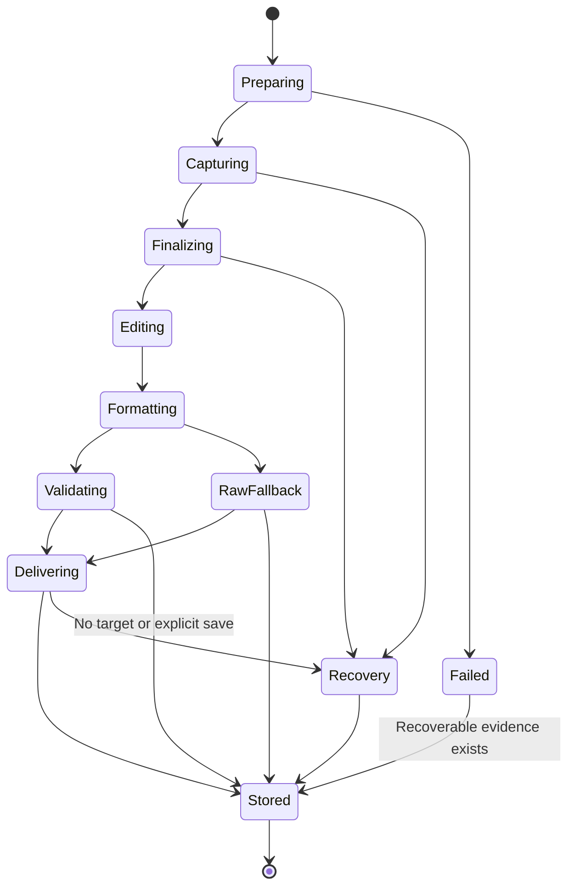
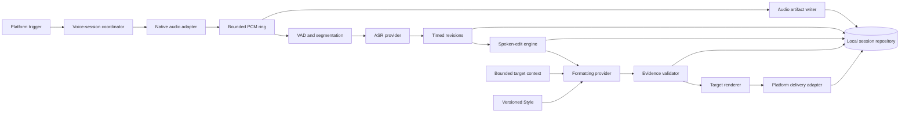

# Local-first voice platform design

**Status:** Accepted roadmap; macOS M1–M15 and iOS Gate K0 through I11 are
implemented in source across the current stacked branches. Current evidence is
called out explicitly. The
durable decision is
[`0029_local_voice_platform_expansion.md`](decisions/0029_local_voice_platform_expansion.md),
and [`voice_cujs.md`](voice_cujs.md) is the acceptance contract.

## Product promise

Add fast, local voice writing to the existing Hardware Controller macOS app.
Speak once and receive target-appropriate text while retaining a private,
searchable recording and transcript history. The same voice engine later powers
an iOS containing app and its custom keyboard extension.

The local-only path must work without accounts, connectivity, remote inference,
or remote storage. Remote model providers remain a later opt-in capability
behind the same provider contracts.

## Product and repository boundary

There is one macOS application: **Hardware Controller**. Voice capture, History,
Models, Dictionary, Styles, and Storage become capabilities within that app.
Physical Controls and global keyboard gestures are independent triggers for the
same Voice session. No second macOS product, bundle, menu-bar process, or release
track is planned.

There is one repository containing platform applications and reusable engine
code. The target structure is:

```text
apps/
  macos/
    hardware_controller/
  ios/
    voice_input/
    keyboard_extension/
crates/
  voice_archive/
  voice_core/
  voice_models/
  voice_ffi/
packages/
  apple_voice_support/
schemas/
  voice_session/
tests/
  cuj/
```

`voice_input` is the iOS containing app; `keyboard_extension` ships inside it.
The structure is a destination, not permission for a mechanical rewrite. Move
the existing macOS code only when a vertical slice needs the boundary, preserve
history with `git mv`, and keep one buildable state after every move.

| Responsibility                                                                               | Owner                                                                   | Reason                                                         |
| -------------------------------------------------------------------------------------------- | ----------------------------------------------------------------------- | -------------------------------------------------------------- |
| macOS presentation, Accessibility delivery, keyboard events, hardware Drivers                | Swift in `apps/macos/`                                                  | Native frameworks and existing implementation.                 |
| iOS app, custom keyboard, App Intents, Live Activity, AVAudioSession                         | Swift in `apps/ios/`                                                    | Apple lifecycle, permission, and extension APIs.               |
| Session state, spoken edits, formatting schema, validation, retention, provider capabilities | Rust in `crates/voice_core/`                                            | One safe, testable implementation for Apple, Android, and desktop platforms. |
| Portable History inventory, identity, and digest verification                                | Rust in `crates/voice_archive/`                                         | Keep database and filesystem layouts outside the interchange contract.      |
| Portable ASR and text inference adapters                                                     | Rust in `crates/voice_models/`                                          | Optimize once and hide third-party kernels.                    |
| Typed platform bindings                                                                      | Rust plus generated or handwritten thin wrappers in `crates/voice_ffi/` | Prevent platform-specific behavior drift.                      |
| Versioned archives and conformance fixtures                                                  | `schemas/` and `tests/cuj/`                                             | Language-neutral contracts.                                    |

## Canonical language

| Term                | Meaning                                                                                             |
| ------------------- | --------------------------------------------------------------------------------------------------- |
| Voice session       | One owned capture or imported-audio workflow from audio through storage and optional delivery.      |
| Audio artifact      | The immutable recording associated with a Voice session.                                            |
| Transcript revision | A timestamped ASR hypothesis that replaces an identified earlier range.                             |
| Raw transcript      | Final ASR text before spoken-edit commands or formatting.                                           |
| Edited transcript   | Raw transcript after deterministic spoken-edit commands.                                            |
| Formatted document  | Validated semantic blocks produced from the Edited transcript.                                      |
| Delivered text      | The target-specific plain-text rendering inserted or explicitly shared.                             |
| Style               | Versioned formatting and rendering preferences.                                                     |
| Dictionary entry    | A canonical spelling, optional aliases, and optional ASR pronunciation hints.                       |
| ASR provider        | A replaceable boundary that converts live or stored audio into timed Transcript revisions.          |
| Formatting provider | A replaceable boundary that converts transcript evidence into a Formatted document.                 |
| Model package       | A versioned local model artifact with identity, digest, license, capability, and resource metadata. |
| Capture owner       | The process with an active, visible right to use the microphone for one Voice session.              |
| Platform adapter    | Native capture, trigger, target-context, delivery, lifecycle, and permission code.                  |
| Retention policy    | Versioned age, size, pinning, and recovery rules for stored artifacts.                              |

Raw, edited, formatted, delivered, and user-corrected text are separate values.
Never overwrite an earlier stage or represent every stage with one mutable
string.

## Feedback translated into behavior

| Observed need                                               | Product behavior                                                                                           |
| ----------------------------------------------------------- | ---------------------------------------------------------------------------------------------------------- |
| Send long messages without making the recipient play audio. | Dictate, format, insert, and retain the recording locally.                                                 |
| Give an AI tool substantial context quickly.                | Global Hold/latch capture, long-session stability, technical vocabulary, and multiline delivery.           |
| Respond while reading a long answer.                        | Latch mode, quiet provisional HUD, stable pauses, and target ownership checks.                             |
| Capture texts, notes, and journal entries on iPhone.        | A custom keyboard mic button backed by the containing app's local capture and model runtime.               |
| Capture hands-free or under lock.                           | Explicit App Intent or Action button start, visible background capture, Live Activity, and later delivery. |
| Recognize names, companies, Bash, Git, and domain language. | Shared Dictionary entries, exact replacements, ASR hints, and Technical Style.                             |
| Remove fillers and abandoned phrases.                       | Conservative spoken-edit operations followed by validated local formatting.                                |
| Dictate lists.                                              | Semantic list blocks rendered for the target's multiline capability.                                       |
| Backtrack while speaking.                                   | Explicit spoken-edit operations with an escape for literal command phrases.                                |
| Work across applications.                                   | Broad macOS insertion and an iOS keyboard, with explicit unsupported and secure-field states.              |
| Recover failed insertion.                                   | Durable History independent of target delivery success.                                                    |
| Avoid waiting after release.                                | Streaming ASR, warm models, bounded queues, speculative formatting, and percentile latency gates.          |
| Use casual lowercase on phone and formal grammar on laptop. | Styles resolved by explicit session, target, Profile, surface, and device defaults.                        |

## Experience design

Retain the existing calm, tactile, precise studio-utility character. History
should feel like a quiet tape archive: typography, spacing, waveform, and
playback position provide hierarchy; color remains reserved for recording,
attention, and failure.

### macOS

Hardware Controller stays quiet in the menu bar. A configured exact chord works
without a physical Device:

- Hold begins on key-down and finishes on key-up.
- Two short presses within a measured interval latch capture; the next two
  short presses finish it.
- Capture begins on the first key-down. A long hold never waits for the
  double-press interval.
- Repeats, lost key-up, sleep, permission loss, process termination, and target
  replacement end ownership through the same idempotent state machine.

The menu-bar **Record Voice** action starts or finishes that same process-owned
session without opening the main window or replacing the external text target.
Controls, chord interpretation, and the menu action remain input adapters; none
owns ASR, formatting, History, retention, or delivery.

The HUD shows capture state and provisional text. It does not become a permanent
floating widget, follow the pointer, or submit the target.

The existing window gains a Voice workspace:

1. History lists sessions by time, duration, source app, Style, and outcome.
2. Session detail synchronizes playback with Raw, Edited, Formatted, Delivered,
   and user-corrected text.
3. Explicit actions copy, reformat, retranscribe, export, pin, or delete.
4. Settings expose Models, Dictionary, Styles, Capture, Storage, Privacy, and
   Control/keyboard trigger bindings.

### iOS containing app and keyboard

The iOS product includes a full custom keyboard with a mic button. That is a
required experience, not a later optional study. The architecture must respect
the extension boundary:

- Apple does not give a custom keyboard extension microphone access, including
  with Full Access. The containing app owns AVAudioSession, audio capture, local
  ASR, formatting, History, and model packages.
- The keyboard owns QWERTY input, globe/next-keyboard behavior, mic/status/stop,
  Style selection, recovery actions, and final insertion through
  `textDocumentProxy`.
- A same-team Keychain access group carries bounded commands, session state, and
  final output with this-device-only protection and cloud synchronization off.
  No audio, model, History database, or target context enters that channel.
- Full Access enables the local Keychain handoff. Without it, the keyboard
  remains a functional QWERTY keyboard and explains why voice input is disabled.
- The main app requests microphone permission, installs or imports models,
  manages History, and starts any background-capable Voice session. The
  extension never attempts to request microphone permission.

The supported warm CUJ begins after the containing app has confirmed Capture
ownership. The keyboard mic requests stop, waits for the same session to become
ready, and makes one automatic insertion attempt at the current cursor. Tapping
mic while idle provides concise instructions instead of displaying false
recording state.

Recording and Transcribing publish bounded heartbeats. After three seconds
without a valid pulse, the keyboard clears its target, stops polling, and shows
one `Restart…` action that explains the approved app or Control Center path.
The action never launches the app. A result must be newer than the snapshot that
caused the stop, and a durable same-session receipt defeats every replay.
If UIKit does not confirm a field update within 500 milliseconds, one
`Recover…` menu offers a single explicit same-process retry or local-only copy.
Every action revalidates the exact result, receipt, document, and host-change
revision. Copy is capped at 256 KiB of UTF-8 and expires after ten minutes;
target ambiguity and extension restart use containing-app History.

Gate K0 confirms that a keyboard cannot access the microphone or launch its
containing app under documented App Review rules. Cold capture starts through
the containing app, Control Center, Siri, Action button, or another approved
`AudioRecordingIntent`. Intent-started recording publishes the required Live
Activity; the user then returns to the target app manually. Proprietary behavior
is UX evidence, not authorization for an undocumented activation mechanism.

The keyboard cannot reliably identify the host application. Styles therefore
resolve from explicit keyboard selection and device/surface defaults, not an
assumed target bundle identity.

### Platform priority and line of sight

| Platform | Program position | Architectural requirement |
| --- | --- | --- |
| macOS | Active roadmap | Voice writing and History inside the existing Hardware Controller app. |
| iOS | Active roadmap | Containing app, custom keyboard, local inference, insertion, and History. |
| Android | Line of sight | Reuse the portable engine, schemas, archive, provider capabilities, and CUJ corpus later. |
| Windows/Linux | Line of sight | Keep the portable engine free of Apple UI, lifecycle, storage, and audio assumptions. |
| Web/mobile web | Deferred | No implementation or prototype in this program; browser constraints do not shape current milestones. |

## Voice-session state



Persistence and target delivery are independent outcomes. A focus change can
prevent insertion without losing the recording or transcript. A cancelled
accidental capture is not retained unless recovery policy explicitly requires
it.

## In-process pipeline



The audio callback copies bounded PCM frames once and returns. Inference,
encoding, persistence, indexing, UI publication, and delivery consume outside
the callback and cannot apply backpressure to it. Overflow is a typed failure,
not silent audio loss.

This is an in-process library design. A local REST daemon would add process
lifecycle, authentication, serialization, installation, and latency costs
without improving local portability. HTTP belongs only in later remote provider
adapters.

## Model stages and options

Use two specialized model stages with deterministic processing around them:

1. a small VAD/segmentation step identifies speech boundaries;
2. an ASR model converts audio into timed Raw transcript revisions;
3. deterministic spoken-edit logic applies explicit corrections;
4. a small text model optionally creates structured paragraphs and lists; and
5. a deterministic validator and renderer reject unsupported additions and
   produce Delivered text.

One audio-language model is not the default. It couples transcription and
rewriting, weakens streaming and raw-history recovery, raises mobile resource
requirements, and makes failure harder to isolate. A future composite provider
may be benchmarked, but it must emit the same evidence-bearing stages.

### ASR candidates

| Option                                                                       | Streaming/file                               | Portability                                                                       | Planned role                                                |
| ---------------------------------------------------------------------------- | -------------------------------------------- | --------------------------------------------------------------------------------- | ----------------------------------------------------------- |
| Apple Speech/SpeechAnalyzer                                                  | Native live and file capabilities vary by OS | macOS/iOS only                                                                    | Existing baseline and Apple fallback.                       |
| sherpa-onnx with a streaming Zipformer or supported Whisper/Parakeet package | Strong local streaming/offline surface       | macOS, iOS, Android, Linux, and Windows; Rust API over optimized native kernels | Leading portable spike.                                     |
| WhisperKit/Core ML                                                           | Live and file                                | macOS/iOS                                                                         | Apple-optimized comparator.                                 |
| whisper.cpp with quantized Whisper                                           | Live chunking and file                       | Broad native and WASM; C++ kernel behind Rust validation and a narrow C bridge     | Selected first iOS file-ASR provider.                       |
| Candle Whisper                                                               | Model-dependent                              | Rust-first with Metal/CUDA/CPU                                                    | Rust-purity research candidate, not assumed mobile default. |

Model packages initially benchmark:

- a streaming sherpa-onnx Zipformer for first-partial latency;
- NVIDIA Parakeet TDT 0.6B v3 where language/device constraints fit;
- quantized Whisper large-v3-turbo for multilingual quality; and
- the current Apple on-device recognizer as the integration baseline.

Qwen3-ASR remains a file/offline research candidate until its portable streaming
path is measured. No model wins by reputation: select per device tier using the
shared corpus and published quality, latency, memory, energy, size, and license
evidence.

### Formatting candidates

| Option                                        | Portability                                        | Planned role                                              |
| --------------------------------------------- | -------------------------------------------------- | --------------------------------------------------------- |
| Deterministic punctuation/list/filler rules   | All platforms                                      | Always-available no-model fallback.                       |
| Apple Foundation Models `SystemLanguageModel` | Eligible macOS/iOS devices with Apple Intelligence | Zero-download Apple provider when available.              |
| Existing Ollama Qwen3.5 4B                    | macOS                                              | Development and desktop quality baseline.                 |
| `mistral.rs` with Qwen3.5 0.8B or 4B          | Rust, Metal/CPU; mobile packaging must be proven   | Preferred Rust-native portable spike.                     |
| `llama.cpp` with quantized Qwen               | Broad optimized C++ backends                       | Portable comparator if the Rust-native path misses gates. |

The Formatting provider receives text, never audio. A small 0.8B-class model is
the mobile target; desktop may use 4B when latency and memory gates pass. Styles
are versioned data, not prompts scattered through UI code.

### Runtime policy

Own orchestration, schemas, retention, validation, and provider APIs in Rust.
Prefer a proven Rust-native model engine when it meets measured gates. Permit
optimized C/C++ kernels such as sherpa-onnx, ONNX Runtime, whisper.cpp, or
llama.cpp only behind a narrow Rust safety boundary. Do not rewrite mature SIMD,
Metal, or Core ML kernels merely to satisfy language purity. Go has no planned
hot-path role because it adds another runtime without a model-serving advantage
on Apple devices.

The first engine spike selects a narrow synchronous C ABI under
[decision 0035](decisions/0035_portable_voice_c_abi.md). Caller-owned buffers,
versioned layouts, no retained pointers or callbacks, and a real C consumer
make ownership explicit and let thin Swift/Kotlin wrappers remain typed. The
dependency-free Rust domain imports no Apple type. Reevaluate UniFFI for a later
object-heavy or asynchronous boundary when its Swift 6 `Sendable` support meets
the same gates. WASM compatibility is not a current selection gate.

Decision [0042](decisions/0042_ios_whisper_file_asr.md) selects the official
whisper.cpp `b4938` XCFramework for the first iOS completed-file adapter. Rust
revalidates the active package and resolves the digest-verified model role; a
Swift actor exclusively owns the opaque C runtime context and prewarms it.
Framework and model binaries stay out of source control. sherpa-onnx remains
the streaming challenger and must beat the same physical-device corpus.

Decision [0043](decisions/0043_ios_local_formatting_and_history.md) compiles the
existing deterministic spoken-edit, semantic-document, renderer, Style, and
retention sources into the iOS app. The containing app keeps the full Raw stage,
commits Raw/Edited/Formatted plus copied audio and model evidence to system
SQLite before publishing keyboard-ready text, and applies the accepted iOS
90-day/1-GiB/2,000-artifact limits. A later local text-model adapter may improve
surface style, but it must preserve these stages and deterministic fallback.

Decision [0044](decisions/0044_ios_style_qualified_keyboard_delivery.md) keeps
separate app and keyboard surface defaults, freezes the keyboard selection on
the exact schema-V2 stop command, and maps its stable identifier into the
canonical formatter only inside the containing app. A session insertion receipt
wins over any later sequence for the same session and is durably claimed before
the host field changes.

Decision [0045](decisions/0045_ios_host_field_and_delivery_target_safety.md)
permits Voice only for recognized general-text traits and binds delivery to one
ephemeral session/document/change-revision tuple. It retains neither target text
nor host identity; any mismatch recovers from History.

Decision [0048](decisions/0048_ios_bounded_insertion_recovery.md) preserves one
automatic attempt and adds one explicit same-process retry plus local-only,
expiring copy. Recovery requires the exact claimed result and unchanged target;
History remains authoritative across ambiguity or process loss.

## Formatting and backtracking

The spoken-edit engine handles high-confidence commands before generative
formatting:

- `scratch that` removes the current clause since the last stable pause;
- `delete that sentence` removes the current sentence;
- `new paragraph` emits a paragraph boundary;
- `start a numbered list` and `end list` emit structure boundaries; and
- `literal …` forces the following command phrase to remain text.

Do not ask a language model to infer destructive edits without evidence. The
formatter may remove fillers, resolve an immediate restatement, punctuate, and
choose paragraph/list blocks. Validation rejects semantic additions, protected-
token changes, invalid structure, and output with no transcript evidence.

Style resolution order is:

1. explicit Voice session Style;
2. target application Style where target identity is available;
3. active Profile Style;
4. surface default, such as iOS keyboard;
5. device default; and
6. product default.

Initial Styles are Natural, Casual Message, Formal, Technical, and Verbatim.

The current macOS M4 baseline implements the machine-wide General selection,
product-default fallback, and typed replayable spoken edits. Its Swift spoken-
edit schema/engine/replayer, formatting schema, validator, renderer, and
fixtures are the conformance source for the later Rust extraction; target-,
Profile- and device-specific Style overrides remain future resolution inputs;
iOS now implements explicit app and keyboard surface defaults.

## Durable local History and storage caps

Use system SQLite for metadata, transcript stages, and search; store at most one
retained audio file per Voice session. Search indexes, decoded PCM, waveform
summaries, and model caches are derived and rebuildable. Do not create one file
per transcript revision.

| Class                                | Recommended default                                      | Eviction                                      |
| ------------------------------------ | -------------------------------------------------------- | --------------------------------------------- |
| Successful-session audio on macOS    | 90 days, 2 GiB, and 5,000 artifacts; first limit reached | Oldest unpinned audio first.                  |
| Successful-session audio on iOS      | 90 days, 1 GiB, and 2,000 artifacts; first limit reached | Oldest unpinned audio first.                  |
| Transcript/session metadata          | Retain until explicit deletion                           | Not automatically removed when audio expires. |
| Derived waveform/decoded/model cache | 256 MiB per device                                       | Least recently used; always rebuildable.      |
| Installed model packages             | 12 GiB and eight versions on iOS; separate from History  | Never evict implicitly; explicit removal only. |
| Partial/recovery artifacts           | 24 hours after reconciliation                            | Remove only after a typed recovery decision.  |

Age, byte, and artifact-count limits are independently configurable; `Unlimited`
is an explicit choice. Users can pin important audio. Retention never removes an
active session, a pinned artifact, or the only recoverable evidence for an
incomplete session. When audio expires, its transcript remains searchable and
the detail view says why playback is unavailable.

Enforce quotas after session finalization and at startup on a utility executor,
never on the capture or delivery path. Evict to 90% of the configured byte limit
to prevent deletion churn. Low-disk handling may temporarily override normal
cleanup timing but must use the same deterministic order and disclose every
removal.

On iOS, a versioned local preference exposes restrained age, byte, and count
presets. Future or invalid preference bytes are preserved and become read-only.
The repository requests basic volume capacity and restores a 1 GiB reserve; it
never calls the important-usage capacity key. Maintenance runs after durable
commit, on History access, and after a settings change. Failure leaves committed
evidence usable, displays one retryable status, and never blocks delivery.

Write audio to a session-scoped partial file, finalize and sync it, atomically
move it to its permanent name, then commit the SQLite transaction. Startup
reconciles partial and orphaned files. Portable V1 export contains a versioned
`manifest.json`, `checksums.json`, and optional `audio.caf`. Import snapshots the
package privately, enforces configurable byte/result caps, verifies the exact
inventory and digests, and restores the immutable result graph without delivery.
The final pre-portable revision 4 `session.json` remains importable on macOS.

Deletion removes the owned record and files. Product copy must not promise
secure erasure from SSD wear-leveling, filesystem snapshots, or device backups.

The current M14 macOS baseline stores linked immutable results in SQLite,
searches every text stage, plays bounded timed CAF spans, and supports explicit
correction, retranscription, reformatting, re-delivery, export, pinning, and
transactional deletion. A portable policy plus dedicated SQLite retention actor
enforces age, count, byte low-water, and low-disk rules after finalization and at
startup while preserving searchable transcript metadata and typed expiration
evidence. Startup reconciliation now repairs interrupted expiration, converts
readable partial and orphan audio into typed Recovery sessions, isolates
malformed rows, preserves physically corrupt databases, and retains completed
text when audio finalization fails. Recovery audio remains playable and locally
retranscribable for 24 hours unless pinned.

M12 adds a native History import path: it validates independent source-byte,
decoded-byte, and duration limits, balances security-scoped access, streams a
supported external recording into one app-owned CAF, and stores typed
imported-audio provenance. The original file remains untouched. Apple
on-device ASR and the selected local Style run before commit; ASR and formatting
fail independently to audio-only and transcript-only History evidence.
Formatting adapters now declare typed identity and locality. The router rejects
remote-capable adapters before any invocation, while in-process Apple and fixed-
loopback Ollama remain independent of external network availability. Formatting
failure delivers deterministic Edited text after target validation. ASR failure
after capture retains playable audio, stores truthful empty stages, and marks
delivery not attempted.

## Privacy and security

Local-only is a product invariant:

- No accounts, analytics, telemetry, remote inference, remote storage, or sync
  ship in the local-only milestones.
- Capture occurs only during a confirmed, visibly indicated owned session.
- Secure targets are rejected. Target context is bounded and absent from
  terminals, browser URLs, screenshots, pasteboard history, and whole documents.
- iOS uses the strongest Data Protection class compatible with intentional
  background capture. The keyboard shares only bounded, this-device-only
  Keychain state and no audio or target context.
- Model packages carry identity, digest, license, capability, and size metadata.
- M13 validates the V1 package schema in portable Rust before installation or
  inference: strict typed metadata, configurable manifest/file/byte limits,
  portable paths, no links or undeclared payloads, exact sizes and SHA-256,
  mandatory notice evidence, and optional out-of-band manifest pinning.
- M14 validates bounded V1 History archives in Swift and portable Rust, checks
  the same source-controlled fixture through the C ABI, and treats self-declared
  checksums as integrity rather than external authenticity.
- Explicit Model-package downloads are allowed before capture from approved
  sources, contain no Voice content, and require digest/license verification.
- Mark owned Voice stores and artifacts as excluded from OS backup where the
  platform supports it. Disclose that manual and external backups remain beyond
  the app's secure-erasure guarantee.
- A provider declaring remote capability is rejected before it receives audio,
  text, context, or history in local-only mode.
- Every iOS check rejects network clients, Network.framework linkage,
  transport-security configuration, push, associated-domain, iCloud, and
  networking capabilities in product sources and configuration.

API-powered providers are a separately approved milestone. They must be
explicitly enabled and visible per session, minimize payloads, define retention,
support cancellation, and preserve a local fallback. A provider seam does not
authorize network code now.

## Latency and quality gates

Measure on the reference and lowest-supported device for each platform. Report
p50, p95, p99, maximum, sample count, model identity/digest, cold/warm state,
thermal state, audio duration, and power mode.

| Interval                                     |           Proposed warm target |
| -------------------------------------------- | -----------------------------: |
| Trigger callback to accepted capture command |                    p99 ≤ 15 ms |
| Accepted command to first owned PCM frame    | p95 ≤ 150 ms; maximum ≤ 250 ms |
| Speech onset to useful provisional text      |                   p95 ≤ 750 ms |
| ASR decoding real-time factor                |                      p95 ≤ 0.5 |
| Stop to Raw transcript                       |                   p95 ≤ 600 ms |
| Stop to validated Delivered text             |     p95 ≤ 1.5 s; maximum ≤ 3 s |
| Completed session to searchable History item |                   p95 ≤ 250 ms |

Quality gates include word-error rate, proper-noun recall, revision stability,
spoken-command precision/recall, filler-removal precision, list accuracy,
protected-token preservation, semantic-addition rejection, audio-drop count,
peak memory, installed size, and energy per audio minute.

## Program delivery and test balance

Use `main` as the integration branch. Each coherent vertical slice uses a fresh
`codex/voice_*` branch from current `main` and a focused pull request into
`main`. A slice includes its acceptance/documentation change, behavior test,
implementation, migration, and verification where those responsibilities change
together. Do not use layer-only batches or unrelated cleanup to manufacture PR
boundaries.

Merge a PR to `main` after required checks pass when repository policy permits.
If policy requires unavailable human review, keep later work in explicit stacked
PRs without bypassing protections. Source integration does not approve release
metadata, tags, packages, notarization, or store submission. See
[`decisions/0052_main_feature_branch_workflow.md`](decisions/0052_main_feature_branch_workflow.md).

Testing uses four complementary levels:

| Level | Purpose | Rigidity policy |
| --- | --- | --- |
| CUJ contract | Fast regression spine through public Voice behavior | Stable outcomes; deterministic providers; no internal call/layout assertions. |
| Adapter integration | Real SQLite/files, audio conversion, FFI, shared Keychain, lifecycle, and delivery seams | Assert boundary contracts, not third-party implementation details. |
| E2E/system | A small set of highest-risk complete macOS and iOS paths | Use accessibility identifiers and user outcomes; do not multiply tests across every combination. |
| Model/performance | Production model quality, latency, memory, energy, and provenance | Use semantic invariants and bounded metrics, not brittle exact prose. |

Intentional behavior changes may update a CUJ and its test in the same PR when
the rationale and equivalent safety coverage are explicit. This keeps the E2E
spine strong without turning exploratory architecture or model work into
snapshot maintenance.

## CUJ-first TDD roadmap

[`voice_cujs.md`](voice_cujs.md) is the acceptance authority. Each implementation
slice follows red → green → refactor through public behavior. Do not write every
test first or batch the entire implementation behind mocked internals.

### C0 — integrate contracts and prove the harness

- Reconcile the accepted decision, canonical language, CUJ observations,
  retention defaults, and current source without reopening approved choices.
- Establish focused branches from `main` and required CI checks.
- Create the repository directory skeleton only as needed by the first test.
- Add one failing, deterministic Mac CUJ M1 tracer test using a short sanitized
  audio fixture, fake capture clock, temporary repository, and fake delivery
  boundary.
- Implement the minimum vertical path to make M1 pass while preserving current
  Local Dictation behavior.
- Establish performance measurement and local-only network-denial fixtures.

### C1 — macOS daily voice writing

- Implement M2–M5 one failing behavior at a time: latch, formatting and Styles,
  backtracking, and safe focus/delivery recovery.
- Add one History path before expanding its UI: stored audio, timed transcript,
  playback, and retry.
- Extract existing code into `apps/macos/` only at boundaries exercised by a
  green test.

### C2 — portable model and storage spine

- Retention tracer complete: one shared CUJ fixture passes through the Swift
  baseline and dependency-free Rust policy; the versioned C ABI passes layout
  and real-consumer checks.
- Benchmark ASR candidates against the same corpus and device tiers; publish the
  selection evidence before choosing defaults.
- Introduce the Rust engine behind the stable CUJ contract; run the same tests
  against Swift baseline and Rust implementation during migration.
- M6–M12 now pass for History, retention, crash recovery, imported files,
  offline enforcement, trigger convergence, portable retention, and model
  fallback.
- M13 now passes one shared Model-package fixture through bounded Rust
  verification and the versioned caller-owned C ABI; no inference runtime or
  default package is selected by that admission contract.
- M14 now passes one shared History archive fixture through Swift, Rust, and the
  caller-owned C ABI. macOS V1 export/restore is transactional, idempotent for
  identical evidence, conflict-safe for reused UUIDs, and migrates revision 4.
- M15 statically links the Rust ABI into the Apple executable behind typed,
  pointer-free Swift values. Production V1 import verifies the private snapshot
  in Rust before complete Swift graph validation and transactional restore;
  digest-stamped builds cannot silently reuse stale Rust code.
- Design separate streaming ownership before exporting ASR or formatting; do
  not assume the synchronous retention ABI fits an async model boundary.

### C3 — macOS hardening

- Complete long-session, corruption, migration, permission, Accessibility,
  latency, memory, energy, signing, installation, and removal evidence.
- Validate Messages, Notes, mail, browsers, terminals, coding tools, and long AI
  prompts without claiming unsupported target behavior.
- Publish no binary until its exact version receives separate release approval.

### K0 — iOS keyboard feasibility gate

- **Implemented:** the containing app owns local PCM capture and its CAF; a full
  QWERTY keyboard remains usable without Full Access; and app, keyboard, and
  Control Center extension exchange only bounded local Keychain state.
- **Implemented:** `AudioRecordingIntent`, Live Activity, heartbeat, single-slot
  commands, stale-session policy, one-time insertion, and honest cold-start
  guidance use documented public APIs. The keyboard never opens the app.
- **Evidence:** 14 unit tests, two containing-app UI tests, a real 51,188-byte
  simulator capture, Messages typing/insertion/manual de-duplication, and a
  strictly verified generic-device build signed by the configured Team. The
  100-round-trip Keychain handoff measured p50 0.819 ms, p95 1.047 ms, and max
  2.990 ms on the reference Mac/simulator pair.
- **Open evidence:** install and exercise the same build on the available
  physical iPhone after one of its three unrelated free-profile development
  apps is removed; benchmark production ASR/formatting on the lowest intended
  iPhone during C4. Neither blocks independent C4 work.

### C4 — iOS containing app and keyboard

- Implement onboarding, model management, History, and in-app local capture.
- **Current evidence:** the K0 project is promoted to
  `apps/ios/voice_input/` with the production identity, local-first permission
  disclosure, explicit microphone request/recovery, exact keyboard guidance,
  and same-device Full Access confirmation. Four policy tests and one real
  Keychain integration test extend the 14-test K0 baseline. Four
  presentation-model tests isolate permission and handoff failures, and a
  focused UI test keeps capture reachable at an accessibility text size.
- **Current Model evidence:** the iOS app links the optimized portable Rust
  validator for device and simulator, imports under security-scoped access,
  applies independent staging limits, atomically installs valid packages into
  protected backup-excluded storage, and labels unpinned origin honestly. The
  library applies injected total-byte and package-version limits, defaulting to
  12 GiB and eight versions, and supports explicit removal without silent age
  eviction. Fourteen focused unit/integration cases cover the model library,
  real linked fixture, limits, links, tampering, identity, idempotence, cleanup,
  removal, and corrupt records; the cold-launch UI CUJ requires the import
  surface.
- **Current ASR evidence:** one compatible package can become the persisted
  active ASR model; app launch, selection, and capture prewarm its exclusive
  whisper.cpp context. Rust revalidates the exact manifest and every payload
  before returning one model path. Stop converts the real CAF to timed Raw text
  through bounded caller-owned buffers. A pinned native integration corpus
  measured warm CPU RTF 0.0111 on the reference Mac; the UI fails explicitly
  when no model is selected. The containing app now applies shared deterministic
  formatting, commits bounded History before publish, and accepts an exact
  Style-qualified keyboard stop. Real-Keychain tests prove warm stop/ready and
  session-level automatic replay suppression. Typed UIKit traits now disable Voice in
  constrained or unverified fields without disabling QWERTY, and an opaque
  document/session plus host-change revision prevents late target-state
  insertion. Physical-iPhone
  percentiles and keyboard evidence remain open because its free profile is at
  the three-app limit.
- **Current lifecycle evidence:** the containing-app actor maps every audio
  interruption, route, background, Low Power Mode, and thermal event into an
  explicit continue/stop decision. Visible Live Activity ownership is required
  for background recording. Stop receives a bounded background task; expiration
  invalidates late finalization and commits exact partial audio to Recovery
  History. Startup reconciliation runs on first History access, adopts only
  readable canonical session artifacts, preserves damaged/unknown files, and
  never auto-resumes. Decision
  [`0046`](decisions/0046_ios_capture_lifecycle_and_recovery.md) owns I7.
- **Current stale-service evidence:** Recording and Transcribing maintain one
  phase-aware heartbeat task. Missing, future, expired, and unknown-schema
  active state stops the keyboard wait within three seconds and exposes one
  honest restart-instruction action. Result sequencing and the durable receipt
  reject regressed or same-session replay. Policy, actor, and real-Keychain
  tests cover I8; physical kill/suspension/upgrade evidence remains open.
  Decision [`0047`](decisions/0047_ios_stale_service_recovery.md) owns I8.
- **Current insertion-recovery evidence:** an unconfirmed insertion exposes one
  bounded `Recover…` surface. A single explicit retry and ten-minute local-only
  copy require the exact Ready result, durable receipt, document, and host-change
  revision; every mismatch recovers from History. The app History surface also
  offers bounded copy. Pure policy tests run within the complete simulator
  build; host-specific callback and rejection behavior remains physical-iPhone
  evidence. Decision
  [`0048`](decisions/0048_ios_bounded_insertion_recovery.md) owns I9.
- **Current offline-storage evidence:** History revision 3 persists pin state;
  local versioned presets apply age/count/byte and 1-GiB-reserve cleanup after
  durable commit without turning maintenance failure into delivery failure.
  Real repository tests cover migration, protected Recovery audio, low disk,
  Data Protection where CoreSimulator exposes it, and backup exclusion. Model
  admission regressions prove byte/version rejection leaves installed packages
  unchanged. A static local-only check runs before every iOS build. Decision
  [`0049`](decisions/0049_ios_offline_storage_enforcement.md) owns I10;
  physical airplane-mode evidence remains final signed-device work.
- **Current system-capture evidence:** a stateful Control Center/Lock
  Screen/Action button control, Siri/App Shortcuts, and Live Activity stop use
  Audio Recording intents and the bounded exact-session command slot. Control
  state reloads only on Recording transitions. Relaunch ends orphaned visible
  ownership, marks the stale session Interrupted, and preserves partial audio
  for History. Copy/share and later keyboard retrieval are explicit; target
  inference is absent. Decision
  [`0050`](decisions/0050_ios_system_surface_capture.md) owns I11; physical
  system-surface evidence remains final signed-device work.
- Every repository check runs the real pinned native transcription and output
  safety assertions. `HC_RUN_IOS_ASR_PERFORMANCE=1` additionally enforces the
  RTF ≤ 0.75 gate only on named hardware; shared virtual CI is not performance
  evidence.
- Keep I1–I11 regressions outcome-based: exact ownership, bounded commands,
  visible recording, durable History, and explicit delivery.
- Run signed-device UI tests for behaviors extension simulators cannot prove.

### C5 — preserve later portability

- Run portable-core conformance and compile checks that prevent Apple-only types
  or lifecycle assumptions from entering the Rust boundary.
- Document the later adapter seams for Android, Windows, and Linux without
  building speculative applications.
- Keep web and mobile web outside the program; do not add WASM/WebGPU work.
- Design remote ASR/formatting providers only after a new privacy, network,
  credential, cost, and retention decision is approved.

## Sources

- [Apple custom keyboard interface constraints](https://developer.apple.com/documentation/uikit/configuring-a-custom-keyboard-interface)
- [Apple document identifier](https://developer.apple.com/documentation/uikit/uitextdocumentproxy/documentidentifier)
- [Apple text interaction callbacks](https://developer.apple.com/documentation/uikit/handling-text-interactions-in-custom-keyboards)
- [Apple keyboard type](https://developer.apple.com/documentation/uikit/uitextinputtraits/keyboardtype)
- [Apple text content type](https://developer.apple.com/documentation/uikit/uitextcontenttype)
- [Apple custom keyboard open-access capabilities](https://developer.apple.com/documentation/uikit/configuring-open-access-for-a-custom-keyboard)
- [Apple App Review Guidelines](https://developer.apple.com/app-store/review/guidelines/)
- [Apple Audio Recording Intent](https://developer.apple.com/documentation/appintents/audiorecordingintent)
- [Apple audio interruptions](https://developer.apple.com/documentation/avfaudio/handling-audio-interruptions)
- [Apple audio route changes](https://developer.apple.com/documentation/avfaudio/responding-to-audio-route-changes)
- [Apple power and thermal notifications](https://developer.apple.com/documentation/xcode/responding-to-power-notifications)
- [Apple background execution modes](https://developer.apple.com/documentation/xcode/configuring-background-execution-modes)
- [Apple Keychain Sharing](https://developer.apple.com/documentation/security/sharing-access-to-keychain-items-among-a-collection-of-apps)
- [Wispr Flow iPhone keyboard setup](https://docs.wisprflow.ai/articles/7453988911-set-up-the-flow-keyboard-on-iphone)
- [Wispr Flow iOS 26.4 behavior](https://docs.wisprflow.ai/articles/6269634092-adapting-to-ios-26-4)
- [Wispr Flow microphone-session behavior](https://docs.wisprflow.ai/articles/3634682593-why-the-orange-dot-or-mic-indicator-stays-on-after-dictating-ios)
- [sherpa-onnx runtime](https://k2-fsa.github.io/sherpa/onnx/index.html)
- [sherpa-onnx Rust API](https://docs.rs/sherpa-onnx/latest/sherpa_onnx/)
- [WhisperKit](https://github.com/argmaxinc/WhisperKit)
- [whisper.cpp](https://github.com/ggml-org/whisper.cpp)
- [Candle](https://github.com/huggingface/candle)
- [ONNX Runtime mobile](https://onnxruntime.ai/docs/tutorials/mobile/)
- [UniFFI](https://mozilla.github.io/uniffi-rs/latest/)
- [Apple SystemLanguageModel](https://developer.apple.com/documentation/foundationmodels/systemlanguagemodel)
- [NVIDIA Parakeet TDT 0.6B v3](https://huggingface.co/nvidia/parakeet-tdt-0.6b-v3)
- [OpenAI Whisper large-v3-turbo](https://huggingface.co/openai/whisper-large-v3-turbo)
- [Qwen3.5 0.8B](https://huggingface.co/Qwen/Qwen3.5-0.8B)
- [llama.cpp](https://github.com/ggml-org/llama.cpp)
- [mistral.rs](https://github.com/EricLBuehler/mistral.rs)
